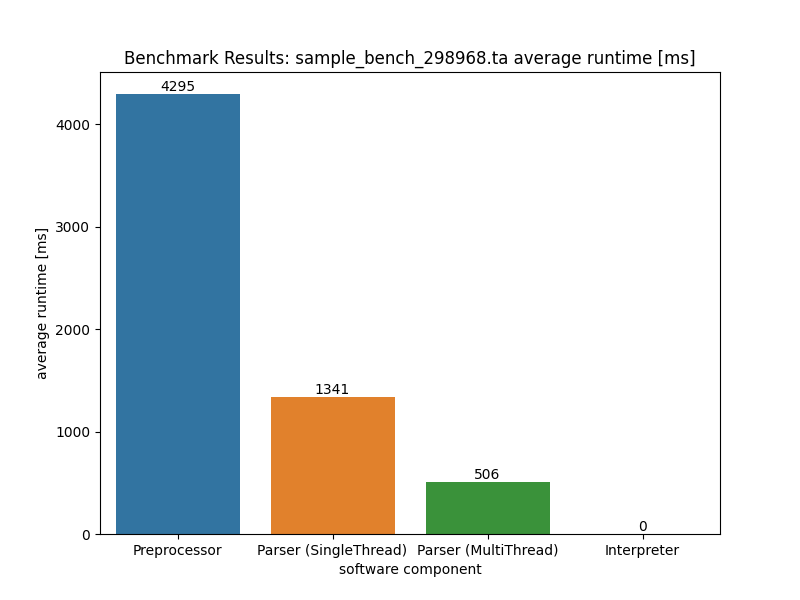

# TangoAway 
### A programming language made for Reverse Engineering and with Assembler in my heart.

### **Last state of the code and documentation was 8th August 2023, so if any content of the README is deprecated now, have the date in mind when the contet was written.**


# **Table of Contents**
1. **[Foreword](#foreword)**
2. **[Architecture & Language component's](#architecture--language-components)**
    - [Virtual Data Register (VDR)](#virtual-data-register-vdr)
    - [Virtual Flag Register (VFR)](#virtual-flag-register-vfr)
    - [Program Counter (PC)](#program-counter-pc)
    - [Instruction set](#instruction-set)
    - [File format](#file-format)
    - [Preprocessor](#preprocessor)
        - [Directives](#directives)
    - [Parser](#parser)
    - [Environment](#environment)
    - [Interpreter](#interpreter)
3. **[Limitation's and future perspective](#limitations-and-future-perspective)**
4. **[Performance, Benchmark's and Test's](#performance-benchmarks-and-tests)**
    - [Benchmark's](#benchmarks)
    - [Test's](#tests)
5. **[Application: RE-Tool](#application-re-tool)**
    - [Command's](#commands)

## **Foreword**
This project was a part of my bachelor thesis and I decided to release it to the public.
As the full context of this bachelor thesis is not given, this project and/or README may be confusing for some people.
I understand that initially trying to understand the whole architecture can be challenging, so I included some graphics for the preprocessor and parser.
These graphics are in German but I'm sure anyone can use some kind of translator.

Also currently I have no plans or intention to develop on this project anymore.
Sadly I don't have the time to do so anymore.
If you have any questions or need help at setting this project up, I can't offer help.
Many of my ideas aren't implemented in this version of TangoAway because I was limited by time when I developed this programming language.

### **So just take it as it is and don't annoy me with my code - I know it could be better, lol.**

Also I translated this README quite a lot, if there any mistakes don't hesitate to open a pull request and I will merge them, thanks!
I'm very honored and thankful to the people, which allowed me to work on topics like these.

Thank you for **everything**!

## **Architecture & Language component's**
  The own programming language should, due to the always new problems and the associated necessary new solution ways, be modularly developed and extendable.
  Here the flexibility, within the possible extension of the language, should have the highest priority, and be as simple and as little time-intensive as possible convertible.
  Accordingly the choice of the syntax and semantics check must be adapted to these goals and optimized thereupon.
  It should be furthermore possible to be able to develop within the own programming language with their language elements new abstraction layers.


  Concretely it means a procedure step before the actual for example Parsen of the source code to have, which can enrich the source code which can be parsed again.
  Thereby by a preceding program the source code is enriched.
  This would serve the desired flexibility of the programming language and could be used for example for own optimizations of the user within programming. 
  Furthermore the executed source code should be at any time observable for the user and not be translated into machine code.
  This would make it possible to analyze and evaluate individual instructions at runtime without having to bear the expense of further translation.
  Here it would offer itself to create a new file format for the source code and for the already enriched source code, which would be supplied for example to the Parser in the next step.
  Thus it would be always possible for the user to receive insight into the original source code and to see, how the enriched source code looks.
  This would benefit transparency and thus the overview or tracking of any logic or semantic errors that may have arisen.


  With the focus on the Reverse engineering, and/or the change between static and dynamic analyzing, it should be possible to be able to develop and test fast new programs.
  By the fact that during the Reverse engineering much is tried out and programs are often repeated several times, the practicability should be the center of attention.
  The more inflexibly and longer the process of the programming and the testing of the developed programs is, the more impracticable the programming language in practice will behave.
  - ### **Virtual Data Register (VDR)**
    The VDRs are the equivalents to the registers of assembly languages like MASM or NASM. They offer the possibility to store values within the program.
    These are used both by the interpreter and the environments, since these require
    Value memories need. There are 16 different VDRs, which the developer can use.
    can. These start with "vdr0" and end with "vdr15". It is possible both signed,
    as well as unsigned values with the VDRs to represent. As data types can between byte,
    word, dword, qword and float. Thus both integers and floating point
    floating point numbers are supported by the VDRs.
    
  - ### **Virtual Flag Register (VFR)**
    The VFR is a status register, which can realize different statuses by means of bits. It is used by the interpreter as well as the environments. It has the special feature that this cannot be manipulated or read by the developer.
    Only the "cmp" instruction can change this register. 
    The VFR serves the program to be able to make statements to value comparisons. 
    It distinguishes between equal, less and greater. 
    With these three indicators, the program can
    for example correctly convert conditional jumps. The VFR itself is a four byte numerical value, which works with bit flags.
   
  - ### **Program Counter (PC)**
    The PC is the program counter. 
    It contains the address of the currently executed instruction. 
    After successful execution of an instruction, the interpreter modifies the PC accordingly. 
    With it it is possible to implement jump instructions correctly.
    The developer can manipulate the PC only through the unconditional jump. 
    However it is not possible to read the PC itself. 
    The PC is stored in an unsigned integer variable, this means that it can never become smaller than zero.
  - ### **Instruction set**
    
  - ### **File format**
    The file format of the code files ends with the '.ta' extension.
    The file format of the preprocessor is identical to the format of a source code of
    TangoAway. The only difference is that the file ends in ".prp". Thereby
    that the source code has already been processed and enriched by the preprocessor.
    has been enriched accordingly. 
    
    Thus no preprocessor directives can be found in this file and all
    file and all enrichments for e.g. if- and else-instructions can also be found in the file.
    can also be found in the file. By separating the source file from the exclusively
    preprocessed source file, complete transparency to the developer is ensured as to which instructions are executed,
    which instructions are executed.
  - ### **Preprocessor**
    The TangoAway preprocessor provides an additional abstraction view of the language for the developer.
    This enables the developer to modify the instruction syntax itself and add new language elements to the language.
    This is done by using preprocessor directives, i.e. commands for the preprocessor.
    The existing directives of the preprocessor, are described in **[Preprocessor directives](#directives)**.

    

    The functional flow of the preprocessor is as follows.
    First, the preprocessor is called with a file path to the source file.
    Then it checks whether the file path is valid or not.
    If it is not, the internal error ``PREPROCESS_CODE_FILE_PATH_DOES_NOT_EXIST`` is returned.
    After successful verification, the file will be read.
    If the file is empty, the internal error ``PREPROCESS_CODE_FILE_IS_EMPTY`` is returned.
    In the next step, all indentations of the code, all comments and all empty lines are removed.
    This serves the efficiency for the further steps, since these elements and/or lines are not relevant, for the further processing.
    If there are import directives in the code, they are processed recursively one after the other.
    This ensures that the imports are correctly resolved from the already imported source files.
    After the imports have been processed, the program checks whether defines or macros have been used in the code.
    If this is the case, the defines are extracted from the code.
    After successful extraction of a define, the corresponding line of code is marked as deletable.
    This is done by replacing the content of the line with a static string, which later serves as a marker.
    The preprocessor checks the syntax of the preprocessor directives.
    For example, if a define directive is not correct, the internal error ``PREPROCESS_INVALID_DEFINE_SYNTAX`` is returned.


    When a macro is extracted, the instructions of the macro are stored temporarily.
    If the macro has parameters, care is also taken to replace these lines of code with a macro marker accordingly.
    The macro marker is used for later correct replacement of the passed arguments.
    This ensures that the specified order of the arguments can be maintained.
    After saving an instruction of the macro, the corresponding line of code is marked as deletable.
    If the syntax of the macro is not correct, the internal error ``PREPROCESS_INVALID_MACRO_SYNTAX`` is returned.
    Furthermore, the internal error ``PREPROCESS_MACRO_END_MISSING`` is returned if a macro has not been completed correctly.
    Now that all existing defines and macros have been extracted, the lines marked for deletion are removed from the code.


    Now all extracted macros, respectively their instructions and parameters, are correctly resolved and inserted in the source code.
    This means, where a macro was called as an instruction, the corresponding instructions of the macro are now inserted and their arguments are considered.
    Then the defines are inserted in the source code.
    Now the source code is searched for labels and their names are stored temporarily.
    If there are jumps in the source code, their jump lengths are now already resolved.
    This has the advantage that work is taken off the parser and the instruction syntax to be checked can be simplified.
    The preprocessor thus actively enriches the source code for the parser.
    Before the jump is resolved, its syntax is checked.
    If the syntax is not correct, the internal error ``PREPROCESS_INVALID_JMP_SYNTAX`` is returned.
    The resolution of the jump is done by replacing the name of the label within the jump instruction, with the real jump length.
    The jump length is specified in instructions, i.e. with a jump length of 10, 10 instructions are skipped.
    Here it is to be noted that jumps are possible both forwards and backwards.
    Jump lengths greater than zero are considered forward jumps and jump lengths less than zero are considered backward jumps.


    After all jumps have been resolved correctly, existing if- and else-clauses are resolved.
    First, it is checked whether each if- and else-clause has been correctly closed.
    If there are more if- and else-instructions in the source code than their completions or vice versa, then the internal error ``PREPROCESS_IF_END_MISSING`` is returned.
    After a successful check, the existing if- and else-instructions are resolved.
    First, the last if-instruction in the source code is searched.
    Based on its position, the depth of the if instructions is determined.
    The depth means how many if-instructions exist before the last if-instruction.
    This information enables the correct resolution of nested if instructions.
    During the resolution process, the number of instructions within the if and else instructions are determined.
    This number is appended to the corresponding if and else instructions as information for the parser.
    Thus the parser and later the interpreter knows, how far it must jump with not fulfillment of the if-condition, in order to be able to skip the respective cases.
    Furthermore, all else instructions and their terminations are removed from the source code.
    The reason for this is that it saves instructions.
    Because the parser knows the length of the if instructions, no separate instruction is needed for an else.
    The parser passes the length to the instance of the if instruction and the interpreter, after evaluation, will modify the program counter to automatically cover if and else.
    This is another case where the preprocessor can simplify the instruction syntax and potentially increase execution speed.


    Now that all if and else instructions have been resolved, the preprocessed source code is written to a new file.
    The file has the same name as the source file, but the file extension is different.
    The new file now ends in .prp, which stands for an already preprocessed source code file.
    If the writing of the file is not successful, the internal error ``PREPROCESS_COULD_NOT_WRITE_FILE`` is returned.
    Finally, the internal status code ``PREPROCESS_SUCCESS`` is returned.
    - #### **Directives**
    In the following table all directly existing preprocessor directives are listed.
    Not listed are the preprocessor enrichments, such as in jump length calculation or if- and else-instructions.


    

    The ``define`` directive allows the substitution of strings within the source code.
    These words do not have to be complete and can be used for various purposes.
    
    Here is a small example of how you can use a define directive.
    ```
    define add dword, addi
	
	addi vdr1 10
    ```
    Define's can also be used to express mathematical constant's.
    Macros can be used to implement basic inline functions in TangoAway.
    The idea is that a combination of instructions can be specified and parameterized.
    This means the developer is able to use functions known to him, but which have no negative impact on runtime, while increasing the readability of the source code.
    
    Here are some basic math functions shown as macros:
    ```
    define 3.14159265359, PI

    macro circle_circumference r
	  mov float vdr0 r
	  mul float vdr0 2.0
	  mul float vdr0 PI
	end
	
	macro circle_surface_area r
	  mov float vdr0 r
	  mul float vdr0 vdr0
	  mul float vdr0 PI
	end
    ```

    The ability to combine macros with define directives makes them even more powerful.
    With the import directive it is possible to instruct the preprocessor to insert the contents of another file into the current source file.
    Thus, for example, constants and functionality could be swapped out to different files and then imported as needed.
    By offloading the code, maintainability is improved because changes only need to be made in central locations, rather than in each individual source file if the source code were not offloaded.

    Here is a basic example of the import directive:
    ```
    import defines.ta
	
	set float vdr0 PI
	addi vdr1 1337
    ```

    Furthermore, the preprocessor offers the possibility to write comments within the source code.
    This primarily serves the readability and maintainability, because so source code can be documented and also foreign developers can get a better understanding of the code faster.
  - ### **Parser**
    The parser is the central element of TangoAway.
    It converts the read instructions into executable instances of the implementations of these instructions.
    It is also responsible for validating the syntax and semantics of the instructions read in.
    In addition, its implementation is crucial for the performance or practicality of TangoAway.

    
    
  
    Within the parser's approach, a distinction must be made between single-threaded and multi-threaded.
    If the parser works with multiple threads, then the source code that is read in is divided evenly among the available number of threads.
    The syntax and semantic validation is the same for both procedures.
    At the beginning the parser checks if the given file path to the source file is valid and if this source file exists.
    If this is not the case, the status code ``PARSER_FILE_PATH_DOES_NOT_EXIST`` is returned.
    After that the source file is read in and stored temporarily in RAM.
    If the source file should be empty, the status code ``PARSER_PRP_FILE_IS_EMPTY`` is returned.


    Now follows the validation of syntax and semantics of the read instructions.
    For this purpose the program iterates over the read instructions and skips every empty line.
    If the line is not empty, all letters are converted to lower case.
  - ### **Environment**
    An environment, is used by the interpreter to store the program state. It
    contains all relevant information, which are necessary for the condition storage.
    Each environment has a unique name, 16 different VDRs, a Program-
    counter, a VFR, a process identifier of the target process, a handle to the window of the target
    target process and a handle to the target process itself. Furthermore still possibilities exist,
    to switch the outputs on the console on and off, as well as to examine whether
    the environment has already been initialized. The environment offers the interpreter access
    to the register contents of the VDRs, both for reading and for writing. Likewise it is
    it is possible for the interpreter to read and write the VFR. For these actions the
    the environment offers suitable interfaces, which are available to the interpreter.
  - ### **Interpreter**
    The interpreter is responsible for the execution of the instructions, as well as the correct management of the environments.
    It stores and associates the environments with their names.
    Additionally it has an instance of the preprocessor and an instance of the parser.
    Thus, only the interpreter needs to be initialized, which automatically passes the source files to the preprocessor and parser.
    The interpreter provides the developer with an interface for loading an environment, based on its name.
    If the environment name does not exist, the status code ``INTERPRETER_INVALID_ENVIRONMENT_NAME`` is returned.
    Otherwise, the instance of the environment is stored in the interpreter, with its name, and the status code ``INTERPRETER_SUCCESS`` is returned.


    Furthermore, the interpreter offers the developer the possibility to create a new environment.
    If the passed name of the new environment is empty or already exists, the status code ``INTERPRETER_INVALID_ENVIRONMENT_NAME`` will be returned.
    In addition, the interpreter provides the developer with several other interfaces, such as formatted output of the register contents of the VDRs and VFR of an environment, as well as resetting the PC of an environment, as well as direct access to individual VDRs or the VFR of an environment.
    In addition, an interface for the direct execution of instructions on an environment is provided.
    This interface is relevant for benchmarking, for example, which is described in the chapter [Benchmark's](#benchmarks).
    The interpreter offers four possible variations of the interface.
    The first one reads a source file, which passes through both the preprocessor and the parser and is then executed.
    The second one is similar to the first one, but now a certain number of threads can be used for these tasks.
    The developer determines the number of threads used.
    The third automatically adapts the number of threads to the developer's hardware.
    This ensures that the optimal available hardware resources are used.
    And the fourth variation does not read in a source file, but takes directly the instructions to be executed on the environment.
    Thus both the preprocessor and the parser are omitted in this variation.
  - ### **Limitation's and future perspective**
    TangoAway and the RE tool offer many opportunities for further development.
    The interface preparation of TangoAway can be further extended and more deep and high interfaces can be integrated.
    TangoAway's instruction set can be extended, for example a stack is still missing that can be used to temporarily store VDRs.
    The existing preprocessor directives can be extended to provide new possibilities for the individuality of the developer.
    Both the preprocessor, and the Parser can be optimized and the parallelization improved.
    Here it offers itself to fall back to the new language elements from ``C++23``.
    Likewise it would be possible to try out other compilers and optimize the code on these.
    Furthermore the support of the processor architectures can be extended to for example the 32-bit architecture or ARM.
    The commands of the RE tool can be extended to include functionalities such as manipulating a virtual function table.
    TangoAway could be extended to include a debugger, which would be linked to the interpreter.
    Instances of instructions could then be given a corresponding flag which the interpreter could manipulate, thus allowing breakpoints to be inserted/removed.
    Also, a stack and its necessary operations could be introduced for storing register contents.
    Thus most diverse stack manipulations could be accomplished, within the programs.
    However, the use of a ``return address`` would have to be renounced, since the interpreter administers the program counter itself and not the stack operation.

    Due to time limitations, only the Windows operating system was treated in this project.
    However, all shown methods could be applied to any operating system, if the functionalities in the interface preparation of TangoAway, with equivalents of the other operating system would be exchanged.
    Due to the fact that no scientific sources for typical functionalities of reverse engineering are available, the author's personal experience had to be used.
  - ### **Performance, Benchmark's and Test's**
    The need to use parallelization and optimizations arose from the excessively long execution speeds of large files when only one thread was used.
    Structurally, both the preprocessor and the parser provided opportunities to parallelize.
    Both components of TangoAway significantly iterated over large containers, which have been identified as the main problem of long runtimes.
    By choosing C++, as the programming language for the software components for TangoAway, several approaches to parallelization present themselves.


    One approach, which does not rely on the language elements of C++, is to split the processing of the container into multiple threads.
    Here the contents of a source code file are divided evenly among a certain number of threads and processed there accordingly.
    At the end the partial pieces are joined together and processed accordingly.
    This procedure was used with the Parser.
    There the syntactical and semantic validation of the instructions was divided on several Threads.
    Each individual thread creates instances of the instructions, after successful validation of the syntax and the semantics, which are stored at the end in a common container.
    The calculation of the equal code parts of the threads, is done by dividing the size of the instructions by the number of used threads.
    Likewise the remainder was determined over an appropriate modulo operation, which was added to the last thread.
    Afterwards the threads of the C++ standard library were used, to which a Lambdafunktion was passed.
    This Lambdafunktion served for the validation of the syntax and semantics.


    An advantage here was that these Lambdafunktionen had access by reference to contents of the source code file.
    Thus, there was no need to make an additional copy of the individual parts of each thread.
    The threads used controlled index accesses to read their respective instructions from the source container and then processed them.
    Due to the fact that only reading was done, it was possible to do without the use of a mutex, for example.
    Only for the writing of the produced instances of the validated instructions a Mutex was needed, since these instances were written into a common container.
    This approach is possible for the parser, but not for the preprocessor, since in the case of the preprocessor individual iterations are related to each other via the code.
    This means that it is not possible to iterate separately from each other.
    Jump length calculations, use of macros and defines and the correct resolution of if- and else-instructions prevent this.
    So an attempt was made to make the existing iterations faster.
    For this specific language elements, like execution directives and the ranges library, of C++ were used.


    An example of the combination of these language elements with further logic optimizations can be found in the resolution of imports of the preprocessor.
    The old implementation iterated once over the entire source code and searched there for the import directive at each string.
    This means that the entire source code must be iterated and compared expensively and is therefore not practical for larger source code files.
    However, this limitation can be circumvented if the C++ algorithm ``std::count_if`` is combined with the execution directive ``std::execution::par``.
    Here, using parallelization, the number of elements in the code that satisfy certain conditions is counted.
    A lambda function is passed which returns a truth value, namely whether the element starts with ``import``.
    If the count is greater than zero, then the corresponding hits in the source code are resolved.
    However, if the number is less than or equal to zero, the program goes directly to the next step.
    Thus, the execution speed can already be improved using parallelization.
    
    
    Using ``std::ranges::views::enumerate`` or ``std::ranges::enumerate_view`` could further improve the execution speed.
    These language elements were introduced in the new language revision ``C++23``.
    This concerns the iterations, which need a run index.
    Since also there the complete compatibility of the ranges library could be used.
    However, this was not usable at the time of the implementation, since the used compiler ``MSVC`` does not support the feature yet.
    
    
    Likewise, normal iterations could be optimized with new language elements.
    This includes the use of ``std::ranges::for_each``, which has been combined with ``std::count_if`` and the execution directive ``std::execution::par``.
    This improved the execution speed, within the search for existing labels in the source code.
    There are other cases where certain language elements of recent language revisions have not been used because the compiler does not yet support it.
    For example, the ranges library function ``std::ranges::find_last_if`` is not yet supported, which would make it very easy to find the last if instruction in the source code, for example.
    By combining ``std::ranges::find_if`` and ``std::views::reverse``, the missing functionality can be mimicked, but this meant using another inefficient algorithm.
    The interpreter could not be parallelized because the programming language has an imperative programming style and thus ensuring the avoidance of side effects would have significantly exceeded the time frame of the bachelor thesis.
    Here the architecture was selected in such a way that this can be realized as economically as possible.
    
    
    In simple terms, the interpreter iterates over a container of instances of the parsed instructions, which it executes in sequence.
    The instances of the instructions work with polymorphism.
    This means that there is a base class of instructions, which declares all the basic functions and variables, though not yet defined.
    Each instruction itself inherits from the base class and implements the existing functions of the base class.
    
    
    This has several advantages, which have contributed to the interpreter being by far the fastest component of the architecture.
    On the one hand, only one call to the right function of the instruction happens at the assembly level, regardless of the implementation of an instruction.
    The correct function is the function which has been overridden by the respective instruction class.
    This saves valuable time within the execution.
    In addition, the compiler can make better optimizations with this structure, which also improves the execution time.
    On the other hand this concept scales very well, since independently of how many instructions are still added, the most economical principle of the execution always remains the same.
    - #### **Benchmark's**
      Another component of TangoAway provides the ability to create benchmarks, in the form of measurements of the execution speeds of individual components.
      The execution speed of the preprocessor, the parser and the interpreter is measured.
      The parser is measured both with only one thread and with several threads.
      The program adapts the number of used threads, which are distributed to the hardware.
      This allows an optimal use of the available hardware resources.
      Furthermore, the developer can specify the number of repetitions, which indicates how often each program is processed or executed.
      As soon as several repetitions take place, the program automatically forms the arithmetic mean of the measured execution times.
      Four instances are instantiated before the measurement is started.
      A preprocessor, two parsers and an instance of an interpreter.
      One instance of the parser is used for single-threaded and another for multi-threaded measurements.
      Afterwards the environment ``bench`` is created in the interpreter.
      On this environment all measurements are performed.
      
      
      All code files are measured, which are in the subdirectory ''Benchmarks''.
      Here always the single function call of the respective components is measured.
      For the preprocessor this is the function ``process_file``, for the two parsers it is the functions ``parse_file`` and ``parse_file_multithreaded_chunking`` and for the interpreter ``execute_on_env``.
      The execution speed is measured in microseconds.
      After the measurement, all data is put into a CSV file format and saved as ``bench_results.csv``.
      The complete format of the CSV file can be found in the source code of the Tester.
      To generate the code files to be measured, various preprocessor directives and instructions are generated pseudo-randomly.
      However, only arithmetic instructions such as inc, dec, add, sub, mul, div, and, or and xor are supported.
      Exceptions are additionally mov and cmp.
      Since the code executed during reverse engineering depends heavily on the problem at hand, it is not possible to generate a qualitative distribution of instructions bound to the Windows API.
      More focus has been placed on the instructions that are inevitably used by the developer to implement its logic.
      Furthermore, the execution time of the respective functionalities of the Windows API is independent of the implementations in TangoAway.
      This is controlled and managed by the Windows operating system.
      The define and macro directives are supported.
      Both define and macro directives use pseudo-randomly generated words and instructions, respectively.
      Macros are also passed arbitrary parameters.
      Instructions, however, are used as comments.
      To measure execution speed, the designated function of the C++ standard library ``std::chrono::high_resolution_clock::now()`` is used.
      It provides a precise and flexible way to measure execution time.
      
      
      All benchmarks were run on Intel's ``i9 13900KF``.
      The processor was not overclocked, i.e. the clock frequency and similar values correspond to the delivery state of the CPU.
      Furthermore, care was taken that the number of active processes was as low as possible and turned out the same in every measurement.
      MSVC with the platform toolset v143 was used as compiler.
      The compiler flags ``/Oi``, ``/Ot`` and ``O2`` were used to optimize the code.
      From the results, there is a clear practicality to the execution speed of TangoAway programs.
      
      
      
      
      

      In the case where 298,968 instructions pass through the preprocessor, parser, and interpreter, an average total execution time of about 5.6 seconds is obtained with single-threaded parser and about 4.8 seconds with a multi-threaded parser.
      The interpreter does not need a whole millisecond to execute 298,968 instructions.
      Should a file have 10823 instructions, an average total runtime of about 52 milliseconds is achieved.
      Based on the measurement results, it is clear that within the measured size dimensions and instruction set, there is practicality, due to the measured total runtimes.
      Even if the generator omits some instructions that use Windows API interfaces, this would hardly make a difference in practice, even with a factor of 5.
      With 10823 instructions the entire components would then need 260 milliseconds.
      This would not negatively affect the flow, for the developer, in practice.
      From the measurements it is further recognizable that the multi-thread parser is clearly slower with smaller files.
      
      
      Since providing the resources of the operating system, as well as the additional use of for example mutexes produce here a noticeable additional expenditure.
      The multi-thread parser is however with sizes such as 298,968 instructions, nearly three times as fast as the single thread parser.
      This shows that parallelization has been unnecessary for practical programs.
      However, should the special case arise where such a large file needs to be executed, then TangoAway is already prepared for it.
      It is also clear from the measurements that the preprocessor is the slowest component of TangoAway for large files.
      The type of parallelization applied plays a decisive role here.
    - #### **Test's**
      TangoAway offers the possibility to execute and evaluate functional tests with another component.
      Here, similar to the instructions, polymorphism is used.
      There is a base class of a test and each test case inherits from it and implements its methods.
      The base class contains information such as the process name of the target application, the environment name, the file path to the code file to be tested, the file path to the preprocessed code file, the status code after execution and an instance of an interpreter.
      By default, all test cases are initialized with a test environment named ``test-env`` and some other properties.
      The so-called tester is responsible for the instantiation, execution and evaluation of the test cases.
      Here the developer must specify his own test cases and can let test them afterwards.
      By default, 53 different test cases are already implemented, covering the entire instruction set of TangoAway.
      Here, individual instructions have been tested multiple times to cover different edge cases.
      
      The output of the tester, after execution, could look like this (**make sure to start the dummy application before starting the tester!**):
      
  - ### **Application: RE-Tool**
    This chapter will focus on a concrete application example for TangoAway.
    The application to be developed will be called ``RE-Tool``, where ``RE`` stands for Reverse Engineering.
    The RE tool is based on the TangoAway programming language and uses its interpreter to implement its functionalities and execute them.
    It is shown how the architecture of TangoAway can be used to develop an application for reverse engineering.
    Thereby existing problems, within the different applications for reverse engineering, are solved.
    Problems include the lack of compatibility between the different applications and the lack of extensibility of the application itself.
    Furthermore, the RE tool fulfills the requirements of TangoAway, which correspond to the functionalities of reverse engineering, related to dynamic analysis.
    It creates a way to apply reverse engineering methods without requiring detailed domain expertise.
    It can be worked with simple commands, which are based on so-called ``templates``.
    Each command has a concrete template, which can be changed by the user at any time.
    The user's arguments are extracted from his input and inserted into the template.
    Afterwards, the customized source code is passed to the interpreter, which passes it first to the preprocessor and then to the parser.

    

    An example of a template is shown in the following listing:
    ```
    define @PATCHADDR@, PATCH_ADDR
	define @PATCHBYTES@, PATCH_BYTES
	
	mov qword vdr0 PATCH_ADDR
	
	patch_bytes vdr0 PATCH_BYTES
	
	println hex64 patched bytes at hex64 vdr0
	
	# clear all used VDR's
	xor qword vdr0 vdr0
	
	# reset pc and exit
	rpcae
    ```
  In the first two lines, the parameters of the template are defined using a preprocessor directive, which are replaced with the parameters passed by the user before the template is executed.
  By using the preprocessor directive ``define``, the parameter passed by the user must be replaced only at one place of the template.
  Then the instruction overwrites the passed memory address with the passed bytes, and prints a short line on the console for confirmation.
  Finally, the used registers are cleared, the program counter is reset and the program is exited.

  The user is able to quickly add new commands to the RE-Tool.
  Thus, he is free to adapt the RE tool to his problems as he sees fit.
  By using TangoAway, the user does not need to know a complex high-level language such as C++ to do this either, but can work with the intuitive and easy syntax of TangoAway.
  A practical intermediate level has been created that allows the user to quickly get started with reverse engineering.
  Nevertheless, the RE tool can be used by experienced users to perform more complex customized reverse engineering operations.
  Due to the modular structure, it offers the user some possibilities to optimize his workflow.
  It works primarily with console input from the user rather than a graphical interface.
  The user has a set of already implemented commands with which he can handle different reverse engineering tasks.

  A complete list of all usable commands is shown in the next chapter.

  - #### **Command's**
    Here all the available commands for the RE-Tool:
     

  There are 24 different commands already available by default.
With the command ``attach``, the user defines his target process.
The target process is the process that is to be analyzed.
With the command ``bpatch`` he is able to overwrite single bytes in the memory space of the target process.
This applies to both unprotected and protected memory areas.
Protected and unprotected refers here to the rights of the memory area assigned and organized by Windows, such as read, write and execute rights.
This means that global pointers and variables as well as functions of the target process can be manipulated.


With the command ``change_env``, the user has the possibility to change between different environments.
That means, he can create new environments and switch between them.
Thus, the advantages of the architecture and its components of TangoAway are fully exploited here as well.
It is able to use the ``dump_image`` and ``dump_mem`` commands to copy complete images of the PEs or DLLs loaded in the target process at runtime, or to copy out individual specific memory areas.
These memory dumps can then be further processed or analyzed.
Furthermore, the current register contents of all VDRs and the VFR, the current environment, can be output with the ``dump_vdr`` and ``dump_vfr`` commands.
For example, numbers can be quickly displayed in decimal or hexadecimal, or intermediate and final results can be manually checked.


The user can use the command ``find_sig`` to find unique byte signatures within the target process.
The correct memory addresses where the byte signature is located will be displayed on the console.
Furthermore, he can use the command ``fnv`` to generate simple hashes of a specific memory address, as well as an individual size.
Thus strings or whole functions of the target process can be hashed immediately.
Also, with the command ``get_image_info`` he is able to display the virtual memory address of a PE or DLL, as well as its size in bytes.
Additionally he can display a memory area of the target process, like in a hex editor.
This works with the command ``hexdump``, to which a memory address and size must be passed.
Thus strings in different sections can be easily identified or bytes of a function can be analyzed manually.


Furthermore, an overview of the available commands can be output with the command ``help``.
The RE-Tool has, with the command ``inject``, the possibility to load a DLL into the target process.
The user only has to specify the file path and the method of loading, such as load-library.
In addition, the user can terminate the target process by executing the ``kill`` command.
Furthermore, he has the possibility to remove single functions of the target process.
This is done by replacing the bytes of the functions by a so-called no-operation (NOP) byte.
For this the command ``nop_fn`` is used, which only needs the address of the respective function.
It automatically detects the end of the function.
The user can read the memory area of the target process.
In doing so, he is shown various representations of the read value in several data types.
This is possible with the command ``read``, which requires the address of the memory to be read.
Also the currently used environment can be reset.
This means clearing all register contents of VDRs and the VFR.
Furthermore the PC of the interpreter is set to 0.
Thus, after manually executing TangoAway code files, the environment can be restored to its original state.


With the command ``resume``, it is possible for the user to continue a suspended process.
For this purpose, the deep interface of Windows ``NtResumeProcess`` is used.
In addition, software breakpoints can be set to a memory address of the target process with the ``set_bp`` command, so that a corresponding debugger would stop there.
With the two commands ``show_images`` and ``show_threads`` the user gets information about all loaded PEs and DLLs of the target process, as well as all currently running threads.
He has the possibility to see which PE or DLL is loaded in the process, which memory address and size they have and under which file path they have been stored.
To the threads he sees their unique identifiers.
With the command ``suspend`` the user can suspend or stop the target process.
For this the deep interface of Windows ``NtSuspendProcess`` is used.
Another way to extend the RE tool without modifying existing code is to use the ``run`` command.
With this command, TangoAway code files can be executed within the environment.
In other words, the RE tool is not limited to its already implemented commands, but also allows the execution of external source code.
Thus, the user can also implement his own commands.
As last command the user can use ``quit``, which terminates the RE-Tool.